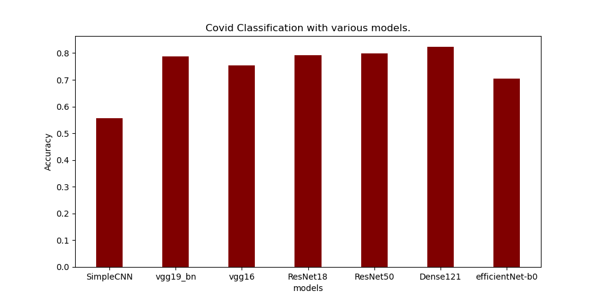

# project.aice.toolbox-uncertainty
The repo containing techniques for uncertainty estimation and calibration of Deep learning architectures and their integration with intel optimization tools like OpenVINO.

  