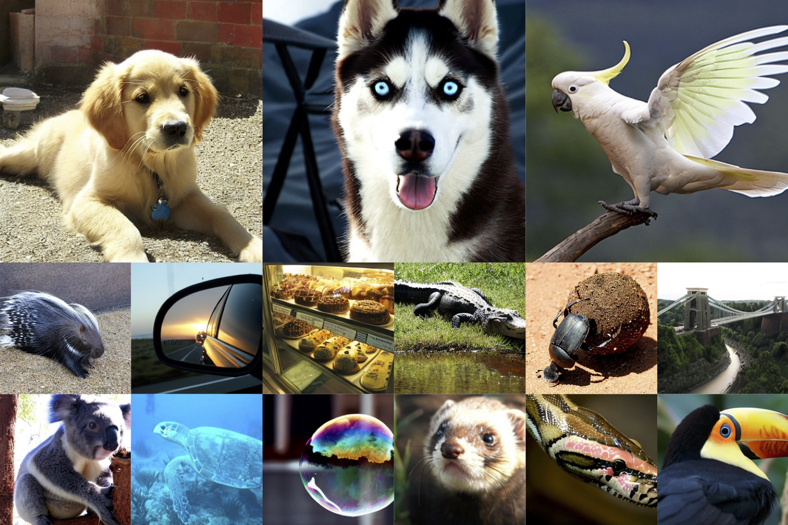

## Scalable Diffusion Models with Transformers (DiT)<br><sub>Official PyTorch Implementation</sub>

### [Paper](http://arxiv.org/abs/2212.09748) | [Project Page](https://www.wpeebles.com/DiT) | Run DiT-XL/2 [](https://huggingface.co/spaces/wpeebles/DiT) [](http://colab.research.google.com/github/facebookresearch/DiT/blob/main/run_DiT.ipynb) <a href="https://replicate.com/arielreplicate/scalable_diffusion_with_transformers"></a>



This repo contains PyTorch model definitions, sampling code and pre-trained weights for our paper exploring 
diffusion models with transformers (DiTs). You can find more visualizations on our [project page](https://www.wpeebles.com/DiT).

> [**Scalable Diffusion Models with Transformers**](https://www.wpeebles.com/DiT)<br>
> [William Peebles](https://www.wpeebles.com), [Saining Xie](https://www.sainingxie.com)
> <br>UC Berkeley, New York University<br>

We train latent diffusion models, replacing the commonly-used U-Net backbone with a transformer that operates on 
latent patches. We analyze the scalability of our Diffusion Transformers (DiTs) through the lens of forward pass 
complexity as measured by Gflops. We find that DiTs with higher Gflops---through increased transformer depth/width or
increased number of input tokens---consistently have lower FID. In addition to good scalability properties, our 
DiT-XL/2 models outperform all prior diffusion models on the class-conditional ImageNet 512×512 and 256×256 benchmarks, 
achieving a state-of-the-art FID of 2.27 on the latter.

This repository contains:

* 🪐 A simple PyTorch [implementation](models.py) of DiT
* ⚡️ Pre-trained class-conditional DiT models trained on ImageNet (512x512 and 256x256)
* 💥 A self-contained [Hugging Face Space](https://huggingface.co/spaces/wpeebles/DiT) and [Colab notebook](http://colab.research.google.com/github/facebookresearch/DiT/blob/main/run_DiT.ipynb) for running pre-trained DiT-XL/2 models

An implementation of DiT directly in Hugging Face `diffusers` can also be found [here](https://github.com/huggingface/diffusers/blob/main/docs/source/en/api/pipelines/dit.mdx).


## Setup

First, download and set up the repo:

```bash
git clone https://github.com/facebookresearch/DiT.git
cd DiT
```

We provide an [`environment.yml`](environment.yml) file that can be used to create a Conda environment. If you only want 
to run the models locally on CPU, you can remove the `cudatoolkit` and `pytorch-cuda` requirements from the file.

```bash
conda env create -f environment.yml
conda activate DiT
```


## Sampling [](https://huggingface.co/spaces/wpeebles/DiT) [](http://colab.research.google.com/github/facebookresearch/DiT/blob/main/run_DiT.ipynb)


You can sample from our pre-trained DiT models with [`main.py`](main.py). Weights for our pre-trained DiT model will be 
automatically downloaded depending on the model you use (default: 256x256 XL/2 model). You can edit the script to use
the 512x512 model, adjust sampling steps, input classes and classifier-free guidance scale, etc.

For convenience, the DiT models can be downloaded directly here as well:

| DiT Model     | Image Resolution | FID-50K | Inception Score | Gflops | 
|---------------|------------------|---------|-----------------|--------|
| [XL/2](https://dl.fbaipublicfiles.com/DiT/models/DiT-XL-2-256x256.pt) | 256x256          | 2.27    | 278.24          | 119    |
| [XL/2](https://dl.fbaipublicfiles.com/DiT/models/DiT-XL-2-512x512.pt) | 512x512          | 3.04    | 240.82          | 525    |


## Differences from JAX

Our models were originally trained in JAX on TPUs. The weights in this repo are ported directly from the JAX models. 
There may be minor differences in results stemming from sampling with different floating point precisions. We re-evaluated 
our ported PyTorch weights at FP32, and they actually perform marginally better than sampling in JAX (2.21 FID 
versus 2.27 in the paper).


## BibTeX

```bibtex
@article{Peebles2022DiT,
  title={Scalable Diffusion Models with Transformers},
  author={William Peebles and Saining Xie},
  year={2022},
  journal={arXiv preprint arXiv:2212.09748},
}
```


## Acknowledgments
We thank Kaiming He, Ronghang Hu, Alexander Berg, Shoubhik Debnath, Tim Brooks, Ilija Radosavovic and Tete Xiao for helpful discussions. 
William Peebles is supported by the NSF Graduate Research Fellowship.

This codebase borrows from OpenAI's diffusion repos, most notably [ADM](https://github.com/openai/guided-diffusion).


## License
The code and model weights are licensed under CC-BY-NC. See [`LICENSE.txt`](LICENSE.txt) for details.
